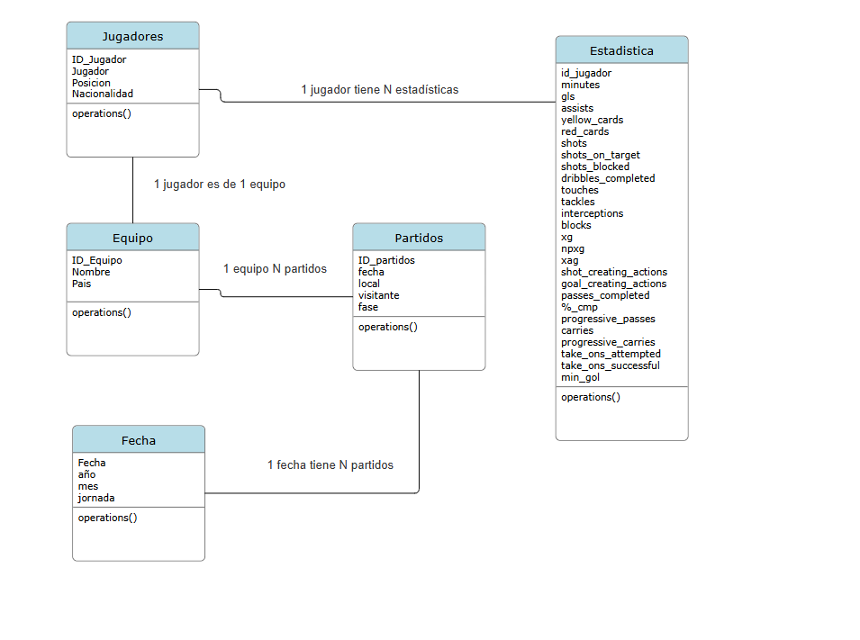

# ⚽ UEFA Champions League 2024-25 Analytics Dashboard

Proyecto de análisis de datos y visualización desarrollado con **Python** y **Power BI** utilizando estadísticas de jugadores y equipos de la UEFA Champions League 2024-25.

El proyecto incluye un proceso ETL para limpiar y transformar los datos, un modelo relacional y un dashboard interactivo en Power BI.

---


# Dashboard


# 📊 Tecnologías utilizadas

- Python
- Pandas
- Jupyter Notebook
- Power BI
- Git & GitHub

---

# 📁 Estructura del proyecto

```
CLeague2024_25/
│
├── data/
│   ├── raw/
│   ├── interim/
│   └── processed/
│
├── notebooks/
│   ├── limpiar_datos.ipynb
│   ├── jugadores.ipynb
│   └── ajustar_Player.ipynb
│
├── powerbi/
│   └── CLeague2024_25.pbix
│
├── images/
│   └── modelo_relacional.png
│
├── docs/
├── dax/
└── README.md
```

---

# 🔄 Flujo ETL

Los datos siguen un proceso de transformación dividido en tres etapas:

```
Raw
    │
    ▼
Interim
    │
    ▼
Processed
    │
    ▼
Power BI
```

## Raw

Contiene los datos originales descargados.

- CLeague2024_25.csv
- jugadores_equipo.csv

## Interim

Archivos auxiliares utilizados durante la limpieza.

- jugadores_unicos.csv
- nombres_raros.csv
- nombres_raros_corregidos.csv

## Processed

Datasets finales utilizados por Power BI.

- CLeague.csv
- jugadores.csv
- equipos.csv
- PlayerTeam.csv

---

# 🗂 Modelo de datos

El proyecto utiliza un modelo relacional compuesto por:

- Equipos
- Jugadores
- PlayerTeam
- CLeague



---

# 📈 Dashboard Power BI

El dashboard incluye:

- 📍 Ubicación de los clubes participantes
- 🏆 Equipos participantes
- 🌍 Países participantes
- 📊 Top 20 nacionalidades
- 🍩 Distribución por posición
- 🌳 Distribución de nacionalidades

---

# 📌 Objetivos

- Limpieza y normalización de datos.
- Creación de un proceso ETL reproducible.
- Diseño de un modelo relacional.
- Desarrollo de dashboards interactivos.
- Aplicación de buenas prácticas en organización de proyectos de datos.

---

# 🚀 Autor

**Jaime Martínez**

GitHub:
https://github.com/MSJaimeCSP